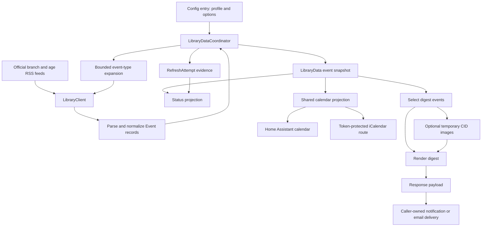

# Architecture

Free Library Events turns official Free Library of Philadelphia RSS data into age-filtered Home Assistant calendars and weekly digest payloads. One config entry owns one profile and a shared in-memory source snapshot. The integration acquires and interprets publisher data; Home Assistant and external clients own delivery, scheduling, and calendar subscription behavior.

For installation and everyday use, see [README.md](../README.md) and [usage.md](usage.md). Contributor checks and release procedures belong in [development.md](development.md).

## Runtime shape



The runtime coordinator lives in `ConfigEntry.runtime_data`. Setup performs the first source refresh before adding the button, calendar, and sensor platforms. Failed or cancelled platform setup unloads any platforms already acquired before allowing a retry. Global setup registers the response-only `free_library_events.render_digest` action and the HTTP route. These registrations can outlive an individual loaded entry; their handlers still require the appropriate loaded runtime.

The principal owners are:

| Concern | Source owner |
| --- | --- |
| HTTP acquisition and feed coverage evidence | [api.py](../custom_components/free_library_events/api.py) |
| Source planning, snapshots, refresh attempts, recovery | [coordinator.py](../custom_components/free_library_events/coordinator.py) |
| Parsing, occurrence identity, matching, digest rendering | [digest.py](../custom_components/free_library_events/digest.py) |
| Shared calendar item projection | [calendar_data.py](../custom_components/free_library_events/calendar_data.py) |
| Home Assistant entities | [calendar.py](../custom_components/free_library_events/calendar.py), [sensor.py](../custom_components/free_library_events/sensor.py), [button.py](../custom_components/free_library_events/button.py) |
| Response orchestration and entry lifecycle | [__init__.py](../custom_components/free_library_events/__init__.py) |
| Image download and disposable storage | [email_images.py](../custom_components/free_library_events/email_images.py) |
| Calendar publishing | [webcal.py](../custom_components/free_library_events/webcal.py) |
| Persistent settings and their UI | [config.py](../custom_components/free_library_events/config.py), [config_flow.py](../custom_components/free_library_events/config_flow.py) |
| Sanitized operational evidence | [diagnostics.py](../custom_components/free_library_events/diagnostics.py) |

## Acquisition must prove its horizon

A source is a branch and official age-category pair, keyed as `branch_code:age_category`. The supported branch codes are `SWK`, `IND`, `CEN`, and `PCI`. Their public metadata and RSS URL construction live in `digest.py`.

Every refresh recomputes age-category selection from the configured birth date and Home Assistant's current local date through 90 days ahead. For a minor, the plan also includes all five child and teen categories so explicit inclusive wording can be discovered outside the most obvious category. Adult and senior source selection follows the overlapping local age windows. A window crossing a life-stage boundary retains the categories needed on both sides.

This 90-day interval selects sources. It does not promise 90 days of events. Coverage recovery targets the Sunday at the end of the digest week, and the publisher's capped feeds can leave that shorter horizon unproven.

`LibraryClient` uses Home Assistant's shared HTTP session. Base feeds are acquired concurrently, then the coordinator selects unresolved capped sources for expansion across the 19 event types in `OFFICIAL_EVENT_TYPES`.

| Bound | Runtime behavior |
| --- | --- |
| Source HTTP work | At most 8 concurrent requests per client; 20-second request timeout |
| Source trust | HTTPS on the two allow-listed Free Library hosts, with no URL credentials or nondefault port; at most 2 redirects, each revalidated |
| Source payload | At most 256 KiB per response; parsing runs off the event loop |
| Adaptive expansion | At most 12 branch/category sources per refresh, prioritizing the digest week's relevant ages, then nearby age windows |
| Expansion lifetime | Each selected source has a 90-second expansion timeout |

A `BranchFeed` retains both normalized events and the evidence needed to judge completeness: published and parsed item counts, ordering, last event date, and any event-type expansion results. The modeled publisher cap is 10 items. A feed proves coverage through a date when:

- every published row parsed and the feed contains fewer than 10 items; or
- every published row parsed, the capped feed is date-ordered, and its last event date is **strictly later** than the requested date; or
- a completed expansion has explicitly proved that horizon.

A capped feed ending on Sunday cannot prove that it includes every Sunday event. Expansion proves coverage only if all official type requests succeed, each type feed proves the horizon, and the union of type feeds recovers every base-feed occurrence. A successful HTTP response alone does not establish those conditions.

Expansion still contributes useful recovered rows when proof fails. Failures, malformed or unordered type feeds, capped type feeds, and missing base-prefix recovery remain separate evidence. Bounded examples appear in state attributes and digest metadata; diagnostics retain all structured type-feed blockers. Expansion cannot infer events the publisher did not expose, and it does not scrape event detail pages to fill a gap.

## Normalization and matching preserve source meaning

`parse_feed` produces frozen `Event` records. It reads the publisher's event date and start time, extracts safe text and links from description HTML, and retains sanitized rich description markup for email. It recognizes explicit end times or durations, venue and room wording, and online or hybrid event wording. Unknown end times remain unknown until a calendar projection supplies a labeled placeholder.

The parser requires an RSS document with exactly one channel, so XML error or challenge pages cannot become successful empty feeds. A valid channel with no items remains a valid empty feed. The parser skips individual rows with unusable dates, times, or oversized fields while retaining the original published count. It limits processing to 100 RSS items and rejects XML DTD and entity declarations, including multibyte encodings. Content limits and skipped rows therefore remain visible as incomplete parsing rather than silently becoming a complete smaller feed.

Ordinary event and description links must be bounded HTTP(S) URLs without embedded credentials. Automatically loaded images have the narrower publisher-hosted HTTPS boundary. Source HTML is sanitized rather than copied into email as executable markup. Venue and modality evidence also controls calendar locations and directions links so an online event does not acquire an invented physical destination.

Published weather-dependent venue alternatives produce an explicit conditional location label and retain the hosting library and source wording across email and calendar projections. Directions are omitted while the destination is conditional. Cancellation-only weather warnings at a fixed venue retain its normal directions.

### Occurrence identity

The identity is:

```text
{event.link or event.title}:{branch.code}:{event_date ISO}:{start_time ISO}
```

The date and time distinguish occurrences that reuse a recurring-series URL. Branch identity distinguishes the same link used at different branches. A source time or date change creates a different occurrence identity; this is not an upstream event-revision tracker.

`merge_events` applies a deterministic, input-order-independent rule. It unions age-category provenance and safe description links, retains richer safe descriptions, and fills available image, end-time, venue, and room fields. An inactive publisher title takes precedence over an overlapping active row, so a cancellation cannot disappear because another feed still carries older copy. Titles marked canceled, cancelled, postponed, or rescheduled are excluded from actionable projections.

Display truncation is downstream of this identity. Shortened email copy must not change the underlying occurrence, calendar UID, or inclusion metadata.

### Age fit

Matching is deterministic and evaluates age **on the event date**. It first considers explicit numeric age wording, then matching publisher categories and specific audience wording, followed by explicit inclusive language. A nonmatching publisher category blocks generic family-oriented inference, while explicit inclusive wording can support a match. Events before the birth date are excluded.

Age-group words match whole words. Baby and infant wording must describe an audience or a recognizable program, so incidental animal references and unrelated words do not supply age evidence. Publisher categories and explicit numeric age ranges retain their precedence.

The publisher supplies category names; the numeric windows below are local interpretation rules, not publisher guarantees. Lower bounds are inclusive and upper bounds exclusive.

| Category | Local window in months |
| --- | --- |
| Baby | 0–36 |
| Toddler | 9–48 |
| Preschool | 30–72 |
| School Age | 60–156 |
| Young Adult | 144–228 |
| Adult | 216 onward |
| Senior | 720 onward |

`Strict` includes `best`; `Recommended` includes `best`, `good`, and `possible`; `Broad` adds `broad`. A filter-mode change affects matching, not the source acquisition plan. Age suitability remains an interpretation of published evidence, and official event details remain the source for attendance and registration decisions.

## Projections have different clocks and guarantees

The immutable `LibraryData` snapshot contains merged events, branch counts, source statuses and errors, and its UTC `fetched_at`. Its nested mappings are detached and read-only. `RefreshAttempt` separately records the latest completed base-source attempt, including counts, sanitized error categories, and expedited-retry status.

Those records serve different purposes: a new failed attempt can coexist with an older retained event snapshot. `last_refresh` describes retained data; `last_attempt` describes the latest attempt. Branch counts measure merged cached rows before age filtering, cancellation filtering, or weekly selection.

| Time domain | Meaning |
| --- | --- |
| Publisher event time | Parsed as Philadelphia wall time; calendar items attach `America/New_York`, including daylight-saving behavior |
| Home Assistant local date | Chooses the source age horizon and digest week |
| Digest week | Monday through Sunday, using the next Monday except that a Monday call includes that same Monday |
| Status projection boundary | Tuesday at local midnight, when the digest-week calculation advances; re-evaluates cached data without source I/O |
| Operational timestamps | Refresh, attempt, image-expiry, and HTTP/calendar modification evidence use UTC |

The status entity keeps an immutable projection for property reads. It rebuilds on coordinator updates, consecutive failed-attempt notifications, the Tuesday boundary, and a Home Assistant timezone change. It writes state only when the projection changes and removes its scheduled callback when unloaded. This avoids both network calls from state reads and a stale weekly count during a prolonged outage.

`build_calendar_items` is shared by the Home Assistant calendar and WebCal. It includes all active, age-matched cached occurrences rather than applying the digest week or email size budget. Recognized end times take precedence; otherwise it uses `calendar_duration_minutes` and explains the placeholder in the description. The Home Assistant calendar selects current/next events and requested overlapping ranges from this projection. Opening a wider range does not fetch more publisher data.

## Recovery retains evidence without concealing failure

A refresh with at least one successful base feed produces a new snapshot from that refresh's successful sources and successful expansion rows. Failed sources are listed as errors; their older rows are not carried forward into the new partial snapshot. If every base source fails, the coordinator fails the update and retains its previous snapshot, if any. That cache is in memory, with no event-history persistence or restart restoration.

The diagnostic status stays available:

| State | Meaning |
| --- | --- |
| `ok` | The retained snapshot proves the digest-week coverage for relevant and supplemental age sources |
| `limited` | Relevant-age coverage is complete, but otherwise healthy supplemental discovery remains capped or unproven |
| `partial` | Relevant-age requests or coverage are incomplete, or supplemental discovery has an operational or parsing failure |
| `error` | The latest coordinator update failed completely; older cache evidence may still be present |

The current-age and supplemental coverage attributes describe the retained snapshot. An `error` state and newer `last_attempt` can invalidate a freshness assumption even when the retained snapshot's coverage flags are true. An empty matched result is likewise not proof that no suitable event exists outside the proven source coverage.

The first failure in a complete-failure streak can receive a five-minute expedited retry only when all failures are retryable transport/HTTP failures and setup has finished. Policy, TLS, parsing, and unsafe-source failures do not qualify. Later failures in the same streak use Core's normal scheduling; any successful base-source refresh resets the streak. Setup retry scheduling belongs to Home Assistant Core.

Manual refresh and forced digest rendering use the coordinator's shared, debounced completion wait. They wait for an actual completed attempt, including work already in flight. A canceled caller or ten-minute wait timeout does not cancel the shared source refresh. Unload releases waiters and prevents them from treating an unloaded coordinator as a successful result.

Consumers expose failure differently:

- The refresh button remains available and reports whether the attempt succeeded.
- The status sensor remains available to expose the failure and retained-cache evidence.
- The Home Assistant calendar follows coordinator availability and becomes unavailable on a failed update.
- WebCal can serve the retained cache while its entry remains loaded.
- A default forced digest fails when the refresh fails. `force_refresh: false` can render retained data; its `fetched_at` is the caller's freshness evidence, and its source warnings describe that snapshot rather than a newer failed attempt.

## A digest is a response with optional temporary files

`free_library_events.render_digest` requires exactly one loaded entry. Its schema accepts `force_refresh` (default `true`) and `embed_images` (default `false`) and returns response data only. It does not send mail or schedule delivery.

The handler captures the accepted profile/options and coordinator before awaiting a forced refresh. It rejects the result if the entry unloaded, its runtime was replaced, or its settings changed during that wait. Rendering then selects active occurrences in the digest week and applies the shared age rules.

Before the first image-download await, the handler retains one immutable `LibraryData` snapshot. Event selection, image inputs, coverage metadata, and `fetched_at` all come from that generation. A later refresh cannot mix newer rows or evidence into a response already being prepared.

The response's `subject`, plain-text `message`, `html`, and `metadata` serve different consumers. Inclusion metadata describes the full age-matched weekly set. Email-specific metadata distinguishes full cards, compact cards, shortened descriptions, and events omitted by output limits. `included_occurrence_ids` preserves occurrence identity; `included_event_ids` is a legacy link-derived projection and must not be treated as a unique recurring-occurrence key.

Email is limited to 100 candidate events and an 80,000-byte HTML budget. The renderer compacts cards and, if necessary, omits lower-priority events with disclosure. Home Assistant's coordinates can locally prioritize nearer branches for richer cards and retention; coordinates and distance values are not printed in the digest. This presentation priority does not alter age fit or the calendar projection. Public event details, registration links, directions, and Google Calendar creation links remain user-followed links rather than automatic registrations or calendar writes.

The email uses presentation tables, percentage line heights, and cell spacing, with a stacked layout that remains usable when a client ignores responsive CSS. Posters retain their aspect ratio and use a 440-pixel fallback width, expanding responsively where supported; branch-calendar columns stack below 390 pixels. These are intentional markup constraints, not a claim that every mail client has been visually verified.

With `embed_images: false`, safe publisher image URLs remain in HTML. With embedding enabled, `email_images.py` deduplicates image requests, downloads at most 12 images with concurrency 4, and bounds each file to 3 MiB and the batch to 15 MiB. Requests have a 15-second timeout and a revalidated, at-most-two-redirect chain. Supported image signatures are checked rather than trusting the response content type.

Transient request failures and resource limits can retain a remote-image fallback. Invalid image data, unsafe redirects, missing images, and per-file oversize failures omit the image instead. Failure counts and bounded examples are returned separately from event-source coverage.

Downloaded images are written to a unique marked `run-...` directory under the integration's `.free_library_events_email` directory. Storage prefers a configured Local Media directory; the fallback is the integration-owned directory under `www`. The response supplies `images` paths for legacy consumers and `attachments` objects for `smtp.send_message` when Local Media is available. CID values use attachment basenames, and only images actually referenced by final HTML are returned.

If storage creation or writing fails, rollback can remove only a run directory created by that invocation. A name collision or failed directory creation must leave pre-existing data intact.

Cleanup is scheduled one hour after a run is stored. An independently tracked storage task registers that cleanup even if the digest caller cancels while files are being written. Later embedded renders also purge stale runs, and integration startup purges previously managed runs from current and legacy locations. Cleanup requires both the expected run name and ownership marker. It preserves unrelated files and directories. Process downtime can delay removal, while a restart can remove images before the nominal expiry. A recipient's retained email or attachment is outside this cleanup lifecycle. Delivery must consume the returned files while they exist, and a failed delivery is the caller's recovery responsibility.

## WebCal is a revocable read capability

Publishing is disabled by default. When enabled, `webcal.py` serves GET and HEAD at:

```text
/api/free_library_events/calendar/{token}.ics
```

The route does not require a Home Assistant login. The opaque token is the read capability, compared against the enabled options of a loaded entry. Unknown tokens, disabled publishing, and unloaded entries return 404. A matching loaded entry without a snapshot returns 503 with `Retry-After: 300`. Requests render the current cache; they do not trigger acquisition or write to an external calendar.

The options flow generates tokens with `token_urlsafe(32)`. Enabling or rotating a token stages the replacement and shows subscription URLs before saving. Saving rejects concurrent changes to either profile data or options. Disabling removes the stored token; rotation invalidates the old address once the replacement is saved. Revocation stops subsequent access through that address but cannot remove copies an external subscriber already retained.

The generated HTTP(S) address prefers Home Assistant's external or cloud URL and falls back to an internal URL, with that scope disclosed. A `webcal://` form is a convenience address for subscription clients. A configured URL does not prove remote reachability; DNS, transport security, access configuration, and subscriber polling remain external concerns.

The serializer uses deterministic RFC 5545 content, escaped text, CRLF line endings, and UTF-8-safe line folding. Calendar UIDs append `@free-library-events.home-assistant` to the shared occurrence identity. Event timestamps are UTC. Entries are transparent, published events; the feed does not model attendance or an upstream revision sequence.

Responses use a body-hash ETag and `Last-Modified` based on the later of the source snapshot and config-entry modification time. GET and HEAD share metadata, conditional requests can return 304, and `If-None-Match` takes precedence over `If-Modified-Since`. The HTTP cache policy is private with a five-minute revalidation interval. Calendar refresh hints reflect the configured source interval, but the subscriber controls when it polls.

The feed omits the configured person's name and birth date. Its selected events and configurable calendar name can still reveal interests or profile-related information. Treat the entire subscription address as sensitive, including when it appears in a subscribing service or proxy log. Diagnostics omit the token and redact the person's name, birth date, and calendar name; they retain source categories, counts, and operational evidence. Error reporting uses allow-listed categories rather than arbitrary exception text.

Invalid stored configuration produces `config: null` and the fixed `invalid_config` category in diagnostics, without exposing the rejected values. Home coordinates and calculated branch distances are never logged, persisted by this integration, or returned in action metadata; the response can indicate that distance priority was used without disclosing those inputs.

## Persistent identity and change boundaries

Config entry version `1.2` separates required profile data from behavior options:

| Owner | Values |
| --- | --- |
| Entry data, edited through reconfiguration | `child_name`, `birth_date`, `branches`, and legacy branch-boolean compatibility mirrors |
| Entry options | `filter_mode`, `calendar_duration_minutes`, `scan_interval_seconds`, `publish_webcal`, `webcal_name`, and the enabled feed's `webcal_token` |

Normalization is shared by UI, migration, and runtime reads. It rejects unsupported branch codes, future or invalid birth dates, fractional timing values, and out-of-range options. The effective runtime config excludes the WebCal token. Unknown existing fields survive the owned-field updates where supported.

Migration accepts older minor versions of entry version 1 and moves combined settings to the `1.2` owners. Legacy options take precedence over data during normalization; legacy branch booleans are maintained as compatibility mirrors. Newer unknown versions are rejected rather than rewritten. This migration changes storage ownership without changing the single-entry identity.

The config entry unique ID remains `free_library_events`, and the integration keeps a generic service-device identity `(free_library_events, free_library_events)`. Entity unique IDs are `free_library_events_calendar`, `free_library_events_status`, and `free_library_events_refresh`. These are registry identities, not promises about user-visible entity IDs, which Home Assistant users may rename. Profile reconfiguration and option updates use native reload behavior; unchanged profile data avoids an unnecessary reload.

Changes should follow the owner that establishes the behavior. Parser or matching changes must remain consistent across digest, status counts, and both calendar outputs. Calendar formatting belongs in the shared calendar projection before either adapter. Acquisition changes must preserve coverage evidence and bounded request work. Publication changes must preserve token revocation, loaded-entry checks, and conditional-response semantics. Image changes must preserve attachment/CID agreement and disposable-file ownership.

Household delivery schedules, recipients, SMTP configuration, credentials, external calendar accounts, and any automation conditions or delivery deduplication belong to their Home Assistant or external-service owners. They are not additional persistent state for this integration. The product's contract ends at its entities, read-only feed, response payload, and temporary image files.

The source contracts are exercised in [test_digest.py](../tests/test_digest.py), [test_integration_ha.py](../tests/test_integration_ha.py), [test_acquisition_ha.py](../tests/test_acquisition_ha.py), and [test_email_images.py](../tests/test_email_images.py). See [development.md](development.md) for how to run the maintained checks.
